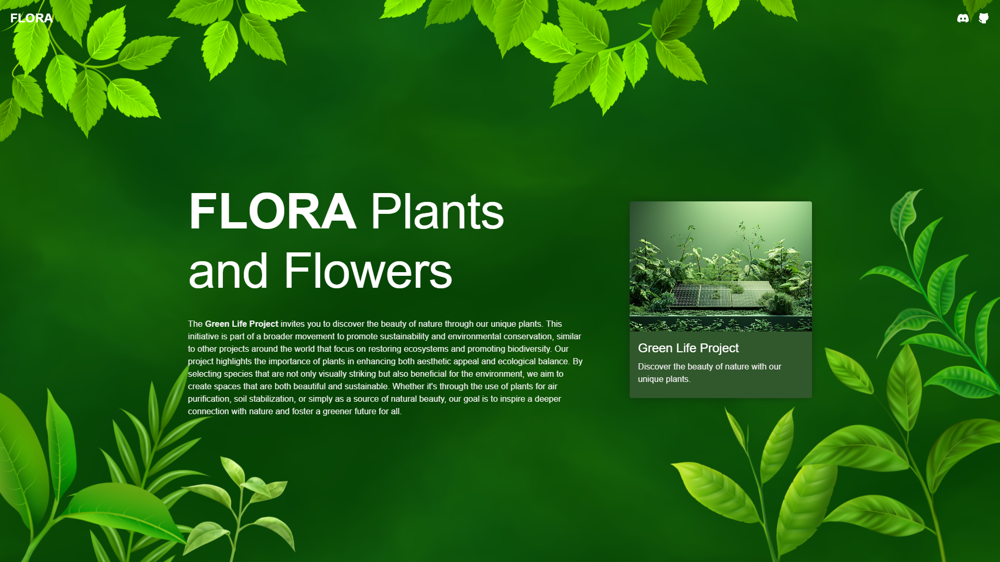

# 🌱 FLORA Plants and Flowers


This project is a responsive landing page website that features various sections dedicated to plants and flowers, as well as introducing the team. To enrich the user experience, the tilt effect was used on cards using the React Tilt library, and animated backgrounds were created with the help of Vanta.js. The styling of the website was realized using Material-UI (MUI), which gives it a modern and visually appealing look. The project focuses on intuitive navigation and attractive layout.



[**➜ Live**](https://oke225.github.io/Flora/)

## ⚙️ Technologies Used

- React

- TypeScript

- MUI - Material UI

- Sass

- React Tilt

- Vanta.js

## 💻 Features

- **Responsive design** - Achieved with Material-UI, the website automatically adjusts to different screen sizes, providing a comfortable browsing experience on both mobile and desktop devices.

- **Animated background** (Vanta.js) - Using Vanta.js allows for the generation of interactive and dynamic animated backgrounds that add dynamics and esthetics to the site's visual presentation.

- **Loading screen** - The loading screen informs users about the ongoing page loading process, enhancing their experience while waiting.

- **Cards with tilt effect** (React Tilt) - Interactive cards utilize the tilt effect, which causes them to subtly tilt in response to the movement of the mouse cursor, increasing user engagement.

These elements come together to create a modern and functional website.

## 📁 Structure

This is the structure of the application, designed to organize the codebase in a clear way. Each folder serves a specific role

```bash
src
├── assets
├── components
├── layout
├── sections
└── styles
```

- `src/assets/` - This directory contains images and other resources needed for the application.

- `src/components/` - contains components that are used in different parts of the application

- `src/layout/` - stores components responsible for the overall structure and layout of the page

- `src/sections/` - contains components representing individual sections of the page

- `src/styles/` - stores style files that are used throughout the entire application

## 📙 Local Setup

1. **Clone the Repository:**

   Open your terminal and clone the GitHub repository using:

   ```bash
   git clone https://github.com/OKE225/Flora.git
   ```

2. **Install Dependencies:**

   Navigate to the project directory:

   ```bash
   cd Flora
   ```

   Then install all dependencies using npm or yarn:

   ```bash
   npm install
   ```

   or

   ```bash
   yarn install
   ```

3. **Start the Application:**

   To run the application locally, use:

   ```bash
   npm start
   ```

   or

   ```bash
   yarn start
   ```

## 📄 License

The [MIT License](./LICENSE) (MIT). Please see License File for more information.

## 🔎 See Also

[GitHub profile](https://github.com/OKE225)
